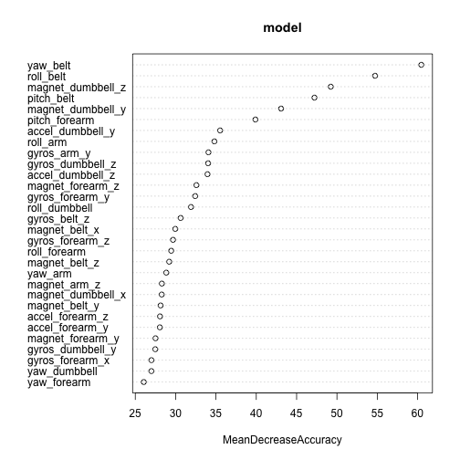

Activity Prediction with Random Forest Algorythm
========================================================

In this article we show how to get predictions about personal activity from a device that records such activities. 

We first load datasets into data frames:


```r
trainingData <- read.csv("pml-training.csv")
testData <- read.csv("pml-testing.csv")
```

Then we take a look at the head of the data for an insight on which data woudl be useful for our purposes.


```r
head(trainingData, n=3)
```

```
##   X user_name raw_timestamp_part_1 raw_timestamp_part_2   cvtd_timestamp
## 1 1  carlitos           1323084231               788290 05/12/2011 11:23
## 2 2  carlitos           1323084231               808298 05/12/2011 11:23
## 3 3  carlitos           1323084231               820366 05/12/2011 11:23
##   new_window num_window roll_belt pitch_belt yaw_belt total_accel_belt
## 1         no         11      1.41       8.07    -94.4                3
## 2         no         11      1.41       8.07    -94.4                3
## 3         no         11      1.42       8.07    -94.4                3
##   kurtosis_roll_belt kurtosis_picth_belt kurtosis_yaw_belt
## 1                                                         
## 2                                                         
## 3                                                         
##   skewness_roll_belt skewness_roll_belt.1 skewness_yaw_belt max_roll_belt
## 1                                                                      NA
## 2                                                                      NA
## 3                                                                      NA
##   max_picth_belt max_yaw_belt min_roll_belt min_pitch_belt min_yaw_belt
## 1             NA                         NA             NA             
## 2             NA                         NA             NA             
## 3             NA                         NA             NA             
##   amplitude_roll_belt amplitude_pitch_belt amplitude_yaw_belt
## 1                  NA                   NA                   
## 2                  NA                   NA                   
## 3                  NA                   NA                   
##   var_total_accel_belt avg_roll_belt stddev_roll_belt var_roll_belt
## 1                   NA            NA               NA            NA
## 2                   NA            NA               NA            NA
## 3                   NA            NA               NA            NA
##   avg_pitch_belt stddev_pitch_belt var_pitch_belt avg_yaw_belt
## 1             NA                NA             NA           NA
## 2             NA                NA             NA           NA
## 3             NA                NA             NA           NA
##   stddev_yaw_belt var_yaw_belt gyros_belt_x gyros_belt_y gyros_belt_z
## 1              NA           NA         0.00            0        -0.02
## 2              NA           NA         0.02            0        -0.02
## 3              NA           NA         0.00            0        -0.02
##   accel_belt_x accel_belt_y accel_belt_z magnet_belt_x magnet_belt_y
## 1          -21            4           22            -3           599
## 2          -22            4           22            -7           608
## 3          -20            5           23            -2           600
##   magnet_belt_z roll_arm pitch_arm yaw_arm total_accel_arm var_accel_arm
## 1          -313     -128      22.5    -161              34            NA
## 2          -311     -128      22.5    -161              34            NA
## 3          -305     -128      22.5    -161              34            NA
##   avg_roll_arm stddev_roll_arm var_roll_arm avg_pitch_arm stddev_pitch_arm
## 1           NA              NA           NA            NA               NA
## 2           NA              NA           NA            NA               NA
## 3           NA              NA           NA            NA               NA
##   var_pitch_arm avg_yaw_arm stddev_yaw_arm var_yaw_arm gyros_arm_x
## 1            NA          NA             NA          NA        0.00
## 2            NA          NA             NA          NA        0.02
## 3            NA          NA             NA          NA        0.02
##   gyros_arm_y gyros_arm_z accel_arm_x accel_arm_y accel_arm_z magnet_arm_x
## 1        0.00       -0.02        -288         109        -123         -368
## 2       -0.02       -0.02        -290         110        -125         -369
## 3       -0.02       -0.02        -289         110        -126         -368
##   magnet_arm_y magnet_arm_z kurtosis_roll_arm kurtosis_picth_arm
## 1          337          516                                     
## 2          337          513                                     
## 3          344          513                                     
##   kurtosis_yaw_arm skewness_roll_arm skewness_pitch_arm skewness_yaw_arm
## 1                                                                       
## 2                                                                       
## 3                                                                       
##   max_roll_arm max_picth_arm max_yaw_arm min_roll_arm min_pitch_arm
## 1           NA            NA          NA           NA            NA
## 2           NA            NA          NA           NA            NA
## 3           NA            NA          NA           NA            NA
##   min_yaw_arm amplitude_roll_arm amplitude_pitch_arm amplitude_yaw_arm
## 1          NA                 NA                  NA                NA
## 2          NA                 NA                  NA                NA
## 3          NA                 NA                  NA                NA
##   roll_dumbbell pitch_dumbbell yaw_dumbbell kurtosis_roll_dumbbell
## 1         13.05         -70.49       -84.87                       
## 2         13.13         -70.64       -84.71                       
## 3         12.85         -70.28       -85.14                       
##   kurtosis_picth_dumbbell kurtosis_yaw_dumbbell skewness_roll_dumbbell
## 1                                                                     
## 2                                                                     
## 3                                                                     
##   skewness_pitch_dumbbell skewness_yaw_dumbbell max_roll_dumbbell
## 1                                                              NA
## 2                                                              NA
## 3                                                              NA
##   max_picth_dumbbell max_yaw_dumbbell min_roll_dumbbell min_pitch_dumbbell
## 1                 NA                                 NA                 NA
## 2                 NA                                 NA                 NA
## 3                 NA                                 NA                 NA
##   min_yaw_dumbbell amplitude_roll_dumbbell amplitude_pitch_dumbbell
## 1                                       NA                       NA
## 2                                       NA                       NA
## 3                                       NA                       NA
##   amplitude_yaw_dumbbell total_accel_dumbbell var_accel_dumbbell
## 1                                          37                 NA
## 2                                          37                 NA
## 3                                          37                 NA
##   avg_roll_dumbbell stddev_roll_dumbbell var_roll_dumbbell
## 1                NA                   NA                NA
## 2                NA                   NA                NA
## 3                NA                   NA                NA
##   avg_pitch_dumbbell stddev_pitch_dumbbell var_pitch_dumbbell
## 1                 NA                    NA                 NA
## 2                 NA                    NA                 NA
## 3                 NA                    NA                 NA
##   avg_yaw_dumbbell stddev_yaw_dumbbell var_yaw_dumbbell gyros_dumbbell_x
## 1               NA                  NA               NA                0
## 2               NA                  NA               NA                0
## 3               NA                  NA               NA                0
##   gyros_dumbbell_y gyros_dumbbell_z accel_dumbbell_x accel_dumbbell_y
## 1            -0.02                0             -234               47
## 2            -0.02                0             -233               47
## 3            -0.02                0             -232               46
##   accel_dumbbell_z magnet_dumbbell_x magnet_dumbbell_y magnet_dumbbell_z
## 1             -271              -559               293               -65
## 2             -269              -555               296               -64
## 3             -270              -561               298               -63
##   roll_forearm pitch_forearm yaw_forearm kurtosis_roll_forearm
## 1         28.4         -63.9        -153                      
## 2         28.3         -63.9        -153                      
## 3         28.3         -63.9        -152                      
##   kurtosis_picth_forearm kurtosis_yaw_forearm skewness_roll_forearm
## 1                                                                  
## 2                                                                  
## 3                                                                  
##   skewness_pitch_forearm skewness_yaw_forearm max_roll_forearm
## 1                                                           NA
## 2                                                           NA
## 3                                                           NA
##   max_picth_forearm max_yaw_forearm min_roll_forearm min_pitch_forearm
## 1                NA                               NA                NA
## 2                NA                               NA                NA
## 3                NA                               NA                NA
##   min_yaw_forearm amplitude_roll_forearm amplitude_pitch_forearm
## 1                                     NA                      NA
## 2                                     NA                      NA
## 3                                     NA                      NA
##   amplitude_yaw_forearm total_accel_forearm var_accel_forearm
## 1                                        36                NA
## 2                                        36                NA
## 3                                        36                NA
##   avg_roll_forearm stddev_roll_forearm var_roll_forearm avg_pitch_forearm
## 1               NA                  NA               NA                NA
## 2               NA                  NA               NA                NA
## 3               NA                  NA               NA                NA
##   stddev_pitch_forearm var_pitch_forearm avg_yaw_forearm
## 1                   NA                NA              NA
## 2                   NA                NA              NA
## 3                   NA                NA              NA
##   stddev_yaw_forearm var_yaw_forearm gyros_forearm_x gyros_forearm_y
## 1                 NA              NA            0.03            0.00
## 2                 NA              NA            0.02            0.00
## 3                 NA              NA            0.03           -0.02
##   gyros_forearm_z accel_forearm_x accel_forearm_y accel_forearm_z
## 1           -0.02             192             203            -215
## 2           -0.02             192             203            -216
## 3            0.00             196             204            -213
##   magnet_forearm_x magnet_forearm_y magnet_forearm_z classe
## 1              -17              654              476      A
## 2              -18              661              473      A
## 3              -18              658              469      A
```

We see that many of the variables have either missing data or NA for data. We exclude thsoe and make a list of useful data variables:


```r
useful_variables <- c("roll_belt", "pitch_belt", "yaw_belt", "total_accel_belt",
                      "gyros_belt_x", "gyros_belt_y", "gyros_belt_z",
                      "accel_belt_x", "accel_belt_y", "accel_belt_z", 
                      "magnet_belt_x", "magnet_belt_y",
                        "magnet_belt_z", "roll_arm", "pitch_arm",
                        "yaw_arm", "total_accel_arm", "gyros_arm_x",
                        "gyros_arm_y", "gyros_arm_z", "accel_arm_x",
                      "accel_arm_y", "accel_arm_z", "magnet_arm_x", "magnet_arm_y", 
                        "magnet_arm_z", "roll_dumbbell", "pitch_dumbbell", "yaw_dumbbell",
                      "gyros_dumbbell_y", "gyros_dumbbell_z", "accel_dumbbell_x",
                      "accel_dumbbell_y", "accel_dumbbell_z", "magnet_dumbbell_x",
                        "magnet_dumbbell_y", "magnet_dumbbell_z",
                      "roll_forearm", "pitch_forearm", "yaw_forearm",
                      "gyros_forearm_x", "gyros_forearm_y",
                      "gyros_forearm_z", "accel_forearm_x", 
                      "accel_forearm_y", "accel_forearm_z", "magnet_forearm_x",
                      "magnet_forearm_y", "magnet_forearm_z", "classe"
                      )
```

We create the new "clean" data frames with only the complete sets of observations


```r
cleanTrainingData <- trainingData[useful_variables]
```

Then we create the splitdf function that will return a list of training and testing sets


```r
splitdf <- function(dataframe, seed=NULL) {
        if (!is.null(seed)) set.seed(seed)
        index <- 1:nrow(dataframe)
        trainindex <- sample(index, trunc(length(index)/2))
        trainset <- dataframe[trainindex, ]
        testset <- dataframe[-trainindex, ]
        list(trainset=trainset,testset=testset)
}
```

Next, we apply the function on the cleaned training data in order to get a new training and test sets:


```r
splits <- splitdf(cleanTrainingData, seed=808)
```

Wesave the training and testing sets as data frames


```r
training <- splits$trainset
testing <- splits$testset
```

For our predictive algoryth we will use the Random Forest algorythm. First, we load the Random Forest library


```r
library(randomForest)
```

```
## randomForest 4.6-10
## Type rfNews() to see new features/changes/bug fixes.
```

We fit the randomForest model


```r
model <- randomForest(classe~., 
                      data = training, 
                      importance=TRUE,
                      keep.forest=TRUE
)
```


```r
print(model)
```

```
## 
## Call:
##  randomForest(formula = classe ~ ., data = training, importance = TRUE,      keep.forest = TRUE) 
##                Type of random forest: classification
##                      Number of trees: 500
## No. of variables tried at each split: 7
## 
##         OOB estimate of  error rate: 0.82%
## Confusion matrix:
##      A    B    C    D    E class.error
## A 2752    4    1    0    0    0.001814
## B   15 1835    6    1    0    0.011847
## C    0   14 1736    3    0    0.009698
## D    0    0   24 1625    2    0.015748
## E    0    0    2    8 1783    0.005577
```

We see that the error rate for this model and this training data is 0.82%. We expect the error rate with the test set to be little larger, about 1%.

Next, we take a look at the importance of various variables for this model.


```r
varImpPlot(model, type=1)
```

 


Next, we use the model to make the predictions on the cleaned test Data set:

```r
predicted <- predict(model, newdata=testing[ ,-50])
```


We want to compare the predicted data to the actual data. For that purpose we look at the number of miscategorized data points

```r
actual <- testing$classe
sum(actual != predicted)
```

```
## [1] 98
```

We see that there are 98 incorrectly predicted observations. Since out testing data has a total of 9811 observations, this error rate is almsot exactly 1%, as we had expected.

Finally, we take a look at the testData. We clean it, and then we make the prediction on it based on our model.


```r
useful_variables_2 <- useful_variables[1:49]
cleanTestData <- testData[useful_variables_2]
predicted_2 <- predict(model, cleanTestData)
predicted_2
```

```
##  1  2  3  4  5  6  7  8  9 10 11 12 13 14 15 16 17 18 19 20 
##  B  A  B  A  A  E  D  B  A  A  B  C  B  A  E  E  A  B  B  B 
## Levels: A B C D E
```

We eneter these predictions into the course testing site. All of the predictions turn out to be correct. This validates our modeling algorythm. 

